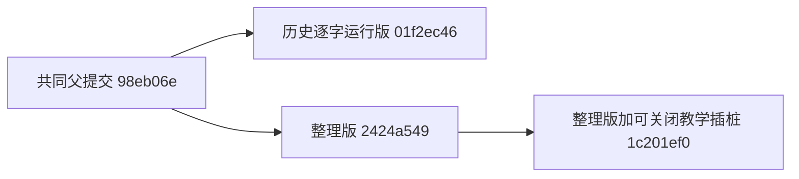
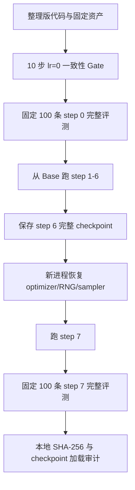
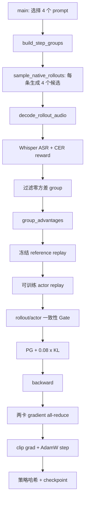

# Qwen3-TTS Hindi SFT LoRA GRPO 整理版学习指南

Last updated: 08/20/2026

- 日期：2026-08-20
- 教学代码提交：`1c201ef03f63573e735c5279b0f7233e223907c6`
- 整理版基线提交：`2424a549288499eb5139eb4ae261e1ceeb0edd01`
- 历史 400 步逐字源码提交：`01f2ec46fb5dd3240a54a8ad7ab14ea132f65263`
- 实验机器：AutoDL 北京 B 区 671 机，`2 x RTX 5090`
- 本地完整证据：[/home/bdong/projects/verl-omni-qwen3-tts-grpo-artifacts/2026-08-20/hindi-cleaned-learning-trace/bundle](/home/bdong/projects/verl-omni-qwen3-tts-grpo-artifacts/2026-08-20/hindi-cleaned-learning-trace/bundle)

## 0. 先把学习对象说准

这次要学的是：

```text
Qwen3-TTS 0.6B Base
        +
已经完成 Hindi SFT 的 rank-8 LoRA
        +
Whisper Hindi CER reward
        +
两卡原生 PyTorch GRPO，继续更新同一个 LoRA
```

它不是此前的中文 AISHELL-3 全量参数训练，也不是 SD3.5 图像 GRPO，更不是从空白 LoRA 开始训练。

这里的 `Base` 或 `step 0` 特指：

> `Qwen3-TTS 0.6B Base + Hindi SFT LoRA`，还没有做本轮 GRPO 更新。

GRPO 会保留两份 SFT LoRA：

| adapter | 作用 | 是否更新 |
|---|---|---|
| `default` | policy/actor，生成候选并接受 GRPO 更新 | 是 |
| `sft_reference` | 冻结的 SFT 参考策略，用于 KL | 否 |

两份 adapter 在 step 0 的 SHA-256 都是：

```text
a89013711edb4136cc89d0a8e4ab34252a872acf19625502797bd66587a1e059
```

## 1. 整理版与历史 400 步版是什么关系

三个提交的关系如下：



- `01f2ec46` 保存 AutoDL 上真正完成 400 步的逐字源码，是历史事实的对照 oracle。
- `2424a549` 是准备进入仓库的整理版，删除运行现场的重复和临时代码。
- `1c201ef0` 只在整理版上增加可关闭的 JSONL/audio 教学证据，不另造训练实现。
- 不传 `--learning-trace` 时，额外的逐 token 序列化、adapter 哈希和候选音频保存都不会执行。

整理版基线的四个直接运行文件共 `2230` 行：

| 文件 | 整理版行数 | 职责 |
|---|---:|---|
| `run_indicvoices_hindi_native_grpo.sh` | 105 | 参数与阶段入口 |
| `train_indicvoices_hindi_native_grpo.py` | 1234 | 两卡训练、验证、checkpoint |
| `native_grpo.py` | 625 | rollout、replay、advantage、loss |
| `whisper_cer_reward.py` | 266 | Whisper 转写与 CER reward |

因此，教学主线只沿这条约 2230 行的整理版真实路径展开。数据构建、框架集成和测试在后面的独立章节学习，不把历史归档的 6317 行当成一次连续函数调用。

## 2. 这次实际重跑了什么



固定训练配置来自启动脚本：

```text
模型：Qwen3-TTS-12Hz-0.6B-Base
SFT 起点：Hindi rank-8 LoRA
训练数据：IndicVoices-R Hindi 863 条
验证数据：固定 100 条
每步 prompt：B=4
每个 prompt 候选：G=4
每步候选总数：16
rollout microbatch：2
最大新 token：240
temperature/top-p/top-k：0.9 / 0.95 / 50
学习率：5e-6，前 10 步线性 warmup
KL beta：0.08
优化器：AdamW
训练参数：LoRA 5,947,392 个参数，462 个 tensor
```

对应源码入口：

- [启动参数](/home/bdong/projects/verl-omni-qwen3-tts-hindi-grpo-learning-trace/examples/grpo_trainer/qwen3_tts/run_indicvoices_hindi_native_grpo.sh:31)
- [短跑与恢复阶段](/home/bdong/projects/verl-omni-qwen3-tts-hindi-grpo-learning-trace/examples/grpo_trainer/qwen3_tts/run_indicvoices_hindi_native_grpo.sh:69)
- [`main()` 训练循环](/home/bdong/projects/verl-omni-qwen3-tts-hindi-grpo-learning-trace/examples/grpo_trainer/qwen3_tts/train_indicvoices_hindi_native_grpo.py:1334)

## 3. 运行结果与结论边界

### 3.1 `lr=0` Gate

| 检查 | 结果 |
|---|---:|
| 连续 step | 10/10 |
| 最大 `diff_mean` | `0.0` |
| 最小 Pearson | `0.9999999999999998` |
| policy 哈希数量 | 1 |
| `policy_changed=true` | 0/10 |

这证明整理版的 rollout token 与 actor 重算 token 完全对齐，而且零学习率不会改变 LoRA。

### 3.2 真正更新的 step 1-7

step 1 因 warmup 学习率为 0；step 2-7 是 6 次非零更新，其中 step 2-6 满足“五次真实更新”门槛，step 7 专门验证断点恢复。

| step | LR | reward | capped CER | KL | 更新后哈希前 8 位 |
|---:|---:|---:|---:|---:|---|
| 1 | `0` | 0.588763 | 0.379987 | 0 | `a8901371` |
| 2 | `5e-7` | 0.746860 | 0.190640 | 0 | `2e0a2b90` |
| 3 | `1e-6` | 0.712788 | 0.255962 | 0.001606 | `ca80a79c` |
| 4 | `1.5e-6` | 0.737372 | 0.231378 | 0.001568 | `9ab81863` |
| 5 | `2e-6` | 0.801737 | 0.198263 | 0.001808 | `55f8b223` |
| 6 | `2.5e-6` | 0.636112 | 0.332638 | 0.001771 | `e834584a` |
| 7 | `3e-6` | 0.800207 | 0.168543 | 0.001644 | `7e72439c` |

这 7 行除 `elapsed_s` 和阶段名外，与历史 400 步正式运行的前 7 行逐字段完全相同。连每一步更新后的 LoRA 哈希都相同，所以整理版确实沿着原训练轨迹运行，并非只得到“大致相似”的 reward。

### 3.3 固定 100 条完整验证

| checkpoint | count | capped CER | WER | score | no-EOS |
|---|---:|---:|---:|---:|---:|
| step 0 | 100 | 0.190846 | 0.463350 | 0.799154 | 2% |
| step 7 | 100 | 0.207952 | 0.445715 | 0.777048 | 3% |

step 7 相对 step 0：

- capped CER 增加 `0.017105`，相对变差 8.96%；
- WER 减少 `0.017635`，相对改善 3.81%；
- composite score 降低 `0.022105`。

不能用这个结果说“GRPO 已改善”，也不能说“GRPO 失败”。7 步的用途是确认整理版执行路径、更新轨迹和恢复链。历史成功证据来自 400 步曲线，固定 100 条 capped CER 在 step 380 最好，为 `0.148162`，相对 step 0 改善 22.37%。

## 4. 建议的学习顺序

后续逐课学习时，每次只讲一个完整块，并维护调用栈，不跨过尚未解释的 helper。

| 课次 | 主题 | 先读的真实源码 | 运行证据 |
|---:|---|---|---|
| 1 | Base 与两份 LoRA 如何加载 | `load_model()` | `model_and_lora_loaded` |
| 2 | 863/100 条数据如何进入程序 | `load_rows()`、`PromptSampler` | `prompt_assignment` |
| 3 | 一个 step 如何在两卡分 4 个 prompt | `build_step_groups()` | 两个 rank 的事件日志 |
| 4 | 一条 Hindi 文本如何生成 4 个 codec 候选 | `sample_native_rollouts()` | token、概率、候选 WAV |
| 5 | codec 如何解码，Whisper 如何给 CER reward | `score_group()`、`compute_score()` | ASR 文本、CER、EOS |
| 6 | 4 个 reward 如何变成相对 advantage | `group_advantages()` | `group_advantages` |
| 7 | reference 与 actor 为什么都要 replay | `train_step()`、`replay_subset_logprobs()` | 三套 logprob |
| 8 | rollout/actor 一致性 Gate | `probability_consistency()` | `diff_mean=0` |
| 9 | PG、KL、backward、两卡 all-reduce、AdamW | `grpo_trajectory_loss()`、`train_step()` | loss、grad、哈希 |
| 10 | checkpoint 保存与新进程恢复 | `save_checkpoint()`、`load_checkpoint()` | step 6 -> 7 |
| 11 | 固定 100 条完整验证 | `evaluate()` | step 0/7 逐样本结果 |
| 12 | 再单独学数据构建、框架集成和测试 | 独立文件 | 不混入训练调用栈 |

第一课应从 `main() -> load_model()` 开始，不先钻入 GRPO 公式。因为如果不知道“谁在训练、谁被冻结”，后面 policy、reference 和 KL 都会混在一起。

## 5. 一次训练 step 的真实调用路径



`main()` 中真正的一步只有以下骨架：

```python
groups, group_metrics = build_step_groups(...)
lr = learning_rate_for_step(step, args.learning_rate, args.warmup_steps)
metrics = train_step(...)
step += 1
save_checkpoint(...)
```

原代码位置：[`main()` step loop](/home/bdong/projects/verl-omni-qwen3-tts-hindi-grpo-learning-trace/examples/grpo_trainer/qwen3_tts/train_indicvoices_hindi_native_grpo.py:1397)。

## 6. 第一课预习：模型和 LoRA 到底怎么加载

`load_model()` 的整体工作是：加载 0.6B 基座，把 Hindi SFT LoRA 复制成“一份可训练 policy + 一份冻结 reference”，然后只把 policy LoRA 参数交给 optimizer。

调用者：[`main()`](/home/bdong/projects/verl-omni-qwen3-tts-hindi-grpo-learning-trace/examples/grpo_trainer/qwen3_tts/train_indicvoices_hindi_native_grpo.py:1349)

被调用函数：[`load_model()`](/home/bdong/projects/verl-omni-qwen3-tts-hindi-grpo-learning-trace/examples/grpo_trainer/qwen3_tts/train_indicvoices_hindi_native_grpo.py:377)

第一段加载基座和两份 adapter：

```python
wrapper = Qwen3TTSModel.from_pretrained(
    str(args.model),
    device_map=str(runtime.device),
    dtype=torch.bfloat16,
    attn_implementation="eager",
    local_files_only=True,
)
wrapper.model = PeftModel.from_pretrained(
    wrapper.model,
    str(args.sft_adapter),
    adapter_name=POLICY_ADAPTER,
    is_trainable=True,
)
wrapper.model.load_adapter(
    str(args.sft_adapter),
    adapter_name=REFERENCE_ADAPTER,
    is_trainable=False,
)
```

第二段不是相信“应该加载对了”，而是逐 tensor 验证 SFT adapter，然后把初始 policy 精确复制到 reference：

```python
verify_adapter(wrapper.model, args.sft_adapter)
default = get_peft_model_state_dict(wrapper.model, adapter_name=POLICY_ADAPTER)
set_peft_model_state_dict(
    wrapper.model,
    {key: value.detach().clone() for key, value in default.items()},
    adapter_name=REFERENCE_ADAPTER,
)
```

最后只收集 policy LoRA：

```python
parameters = [
    parameter
    for name, parameter in wrapper.model.named_parameters()
    if "lora_" in name and f".{POLICY_ADAPTER}." in name
]
```

这次实际日志证明：

```text
base dtype 参数：914,643,008 个 bfloat16 element
LoRA dtype 参数：11,894,784 个 float32 element（policy + reference）
可训练 policy LoRA：5,947,392 个参数，462 个 tensor
初始 policy SHA = reference SHA = a8901371...
```

需要记住：这里不是“先加载 SFT LoRA，再创建一个空白 GRPO LoRA”。GRPO 直接继续更新 SFT LoRA 的 policy 副本；reference 副本保持 SFT 起点不动。

## 7. 用 step 2 的真实数据看完整 GRPO 信号

step 2 是第一次非零学习率更新。下面只展开 rank 0 的 slot 0；整个 step 仍然有 4 个 prompt、16 个候选。

目标文本：

```text
एक अच्छा थूकपाक कैसे पकाते हैं
```

`prompt_id=indicvoices-hi-00009116`，`prompt_index=534`，`generation_seed=42005171`。

| 候选 | frames | Whisper 转写 | CER | reward | advantage | PG share |
|---:|---:|---|---:|---:|---:|---:|
| 0 | 36 | `एक अच्छा थूखपाक किसी पकाते हैं?` | 0.1000 | 0.9000 | +0.8072 | +0.1589 |
| 1 | 51 | `कुपा कैसे पकाते हैं` | 0.4000 | 0.6000 | -1.4281 | -0.4127 |
| 2 | 34 | `एक्षाथ हुकपा कैसे पकाते हैं` | 0.2667 | 0.7333 | -0.4346 | -0.0957 |
| 3 | 50 | `एक अच्छा थुकपा कैसे पकाते हैं` | 0.0667 | 0.9333 | +1.0555 | +0.2687 |

四段实际候选音频：

- [candidate 0](/home/bdong/projects/verl-omni-qwen3-tts-grpo-artifacts/2026-08-20/hindi-cleaned-learning-trace/bundle/run-artifacts/learning-trace-seed-42/learning-trace/audio/step-0002/rank-0-slot-0-candidate-0.wav)
- [candidate 1](/home/bdong/projects/verl-omni-qwen3-tts-grpo-artifacts/2026-08-20/hindi-cleaned-learning-trace/bundle/run-artifacts/learning-trace-seed-42/learning-trace/audio/step-0002/rank-0-slot-0-candidate-1.wav)
- [candidate 2](/home/bdong/projects/verl-omni-qwen3-tts-grpo-artifacts/2026-08-20/hindi-cleaned-learning-trace/bundle/run-artifacts/learning-trace-seed-42/learning-trace/audio/step-0002/rank-0-slot-0-candidate-2.wav)
- [candidate 3](/home/bdong/projects/verl-omni-qwen3-tts-grpo-artifacts/2026-08-20/hindi-cleaned-learning-trace/bundle/run-artifacts/learning-trace-seed-42/learning-trace/audio/step-0002/rank-0-slot-0-candidate-3.wav)

这个 group 的真实统计是：

```text
rewards = [0.9000, 0.6000, 0.7333, 0.9333]
mean    = 0.7917
std     = 0.1341
advantages = [0.8072, -1.4281, -0.4346, 1.0555]
```

候选 3 并不需要达到 CER=0 才能得到正 advantage。它只需在同一个 prompt 的 4 个候选中相对更好。候选 1 的 loss 数值为负也不是“训练坏了”；梯度下降会按 negative advantage 降低它的 token log-probability。

完整记录位于：

- [rank-0 教学 JSONL](/home/bdong/projects/verl-omni-qwen3-tts-grpo-artifacts/2026-08-20/hindi-cleaned-learning-trace/bundle/run-artifacts/learning-trace-seed-42/learning-trace/rank-0.jsonl)
- [step 级训练指标](/home/bdong/projects/verl-omni-qwen3-tts-grpo-artifacts/2026-08-20/hindi-cleaned-learning-trace/bundle/run-artifacts/learning-trace-seed-42/training-metrics.jsonl)

## 8. Reward、advantage、PG、KL 的原公式

### 8.1 Reward

源码：[`compute_score()`](/home/bdong/projects/verl-omni-qwen3-tts-hindi-grpo-learning-trace/verl_omni/utils/reward_score/tts/whisper_cer_reward.py:179)

```text
intelligibility = 1 - min(1, CER)

若无 EOS：length_reward -= 1
若尾部静音过多：length_reward -= 0.5

score = intelligibility + 0.5 * length_reward
```

Whisper 只负责把生成音频转成 Hindi 文字。CER 是目标文字与 Whisper 转写之间的字符编辑率，不是另一个神经 reward model 输出的任意分数。

### 8.2 Group-relative advantage

源码：[`group_advantages()`](/home/bdong/projects/verl-omni-qwen3-tts-hindi-grpo-learning-trace/examples/grpo_trainer/qwen3_tts/native_grpo.py:257)

```text
advantage_i = (reward_i - group_mean) / (group_std + 1e-4)
```

所以 GRPO 不问“0.9 是否达到全局及格线”，只问“同一道题的 4 个候选里谁更好”。

### 8.3 每个候选的 loss

源码：[`grpo_trajectory_loss()`](/home/bdong/projects/verl-omni-qwen3-tts-hindi-grpo-learning-trace/examples/grpo_trainer/qwen3_tts/native_grpo.py:602)

```text
pg = -advantage * sum(actor_logprob) / group_token_count

delta = clip(reference_logprob - actor_logprob, -10, 10)
kl = sum(exp(delta) - delta - 1) / group_token_count

loss = pg + 0.08 * kl
```

step 2 更新前 policy 与 reference 仍完全相同，因此 KL 为 0。step 2 更新后两者开始分开，所以 step 3 的 KL 为 `0.00160599`。

## 9. 为什么要重算 actor logprob

rollout 阶段已经保存每个采样 token 的 `rollout_logprob`。训练时又用同样 token 做 teacher-forced replay，得到：

1. 冻结 SFT reference 的 `reference_logprob`；
2. 当前可训练 policy 的 `actor_logprob`。

对应代码：[`train_step()`](/home/bdong/projects/verl-omni-qwen3-tts-hindi-grpo-learning-trace/examples/grpo_trainer/qwen3_tts/train_indicvoices_hindi_native_grpo.py:833)。

这三套概率各有不同职责：

| 概率 | 来自哪里 | 用途 |
|---|---|---|
| rollout | 真正采样时 | 确认训练的是采样过的策略/轨迹 |
| actor | 当前 policy 重放 | policy-gradient 的可求导概率 |
| reference | 冻结 SFT 重放 | KL 约束 |

在 optimizer 更新前必须先过一致性门槛：

```text
mean(abs(exp(rollout_logprob) - exp(actor_logprob))) < 0.005
Pearson(exp(rollout_logprob), exp(actor_logprob)) > 0.995
```

实现：[`probability_consistency()`](/home/bdong/projects/verl-omni-qwen3-tts-hindi-grpo-learning-trace/examples/grpo_trainer/qwen3_tts/native_grpo.py:264)。

本次 10 个 lr=0 step 和 7 个短训练 step 的 `diff_mean` 全部为 0。任何一步失败都会在 `optimizer.step()` 前抛错，不能带病继续训练。

## 10. 两张 5090 怎么合成一个 step

rank 0 负责 slot 0、2，rank 1 负责 slot 1、3。每张卡各生成：

```text
2 prompts x 4 candidates = 8 段音频
```

两卡合计：

```text
4 prompts x 4 candidates = 16 段音频
```

每张卡独立 backward 后，[`_allreduce_gradients()`](/home/bdong/projects/verl-omni-qwen3-tts-hindi-grpo-learning-trace/examples/grpo_trainer/qwen3_tts/train_indicvoices_hindi_native_grpo.py:622) 对每个 LoRA gradient 做求和，再除以 `world_size=2`。因此两张卡最终执行相同的 AdamW 更新，策略哈希保持一致。

候选音频长度不同，所以某一卡可能先到 collective 等待另一卡。这不是卡死。rank 事件日志会显示它停在 `consistency_gather` 或 `gradient_allreduce`，另一卡仍在长轨迹 replay。

## 11. checkpoint 为什么真的能恢复

保存函数：[`save_checkpoint()`](/home/bdong/projects/verl-omni-qwen3-tts-hindi-grpo-learning-trace/examples/grpo_trainer/qwen3_tts/train_indicvoices_hindi_native_grpo.py:1078)

恢复函数：[`load_checkpoint()`](/home/bdong/projects/verl-omni-qwen3-tts-hindi-grpo-learning-trace/examples/grpo_trainer/qwen3_tts/train_indicvoices_hindi_native_grpo.py:1146)

完整 checkpoint 不只保存 LoRA：

```text
policy LoRA state
AdamW optimizer state
step
PromptSampler permutation/cursor/epoch/RNG
Python RNG
NumPy RNG
每个 rank 的 CPU/CUDA RNG
策略 SHA-256
```

本次实际恢复链：

| 项目 | step 6 保存 | 新进程加载 | step 7 保存 |
|---|---:|---:|---:|
| policy hash | `e834584a` | `e834584a` | `7e72439c` |
| sampler cursor | 24 | 24 | 28 |
| optimizer state entries | 392 | 392 | 392 |

本地 checkpoint：

- [step-0006.pt](/home/bdong/projects/verl-omni-qwen3-tts-grpo-artifacts/2026-08-20/hindi-cleaned-learning-trace/bundle/run-artifacts/learning-trace-seed-42/checkpoints/step-0006.pt)
- [step-0007.pt](/home/bdong/projects/verl-omni-qwen3-tts-grpo-artifacts/2026-08-20/hindi-cleaned-learning-trace/bundle/run-artifacts/learning-trace-seed-42/checkpoints/step-0007.pt)

两份文件都已在本地用 `torch.load(..., map_location="cpu")` 实际打开，并核对 step、策略哈希、sampler cursor 和 optimizer 项数。

## 12. 固定 100 条验证怎么保证可比

[`load_rows()`](/home/bdong/projects/verl-omni-qwen3-tts-hindi-grpo-learning-trace/examples/grpo_trainer/qwen3_tts/train_indicvoices_hindi_native_grpo.py:327) 要求验证集恰好 100 条且 sample ID 唯一。每条数据保存固定 `generation_seed`。

[`evaluate()`](/home/bdong/projects/verl-omni-qwen3-tts-hindi-grpo-learning-trace/examples/grpo_trainer/qwen3_tts/train_indicvoices_hindi_native_grpo.py:1188) 在 step 0 和 step 7 都使用同一批 ID 与同一批 seed，每条只生成一次。

证据：

- [step 0 summary](/home/bdong/projects/verl-omni-qwen3-tts-grpo-artifacts/2026-08-20/hindi-cleaned-learning-trace/bundle/run-artifacts/learning-trace-seed-42/validation/step-0000/summary.json)
- [step 0 的 100 行逐样本结果](/home/bdong/projects/verl-omni-qwen3-tts-grpo-artifacts/2026-08-20/hindi-cleaned-learning-trace/bundle/run-artifacts/learning-trace-seed-42/validation/step-0000/results.jsonl)
- [step 7 summary](/home/bdong/projects/verl-omni-qwen3-tts-grpo-artifacts/2026-08-20/hindi-cleaned-learning-trace/bundle/run-artifacts/learning-trace-seed-42/validation/step-0007/summary.json)
- [step 7 的 100 行逐样本结果](/home/bdong/projects/verl-omni-qwen3-tts-grpo-artifacts/2026-08-20/hindi-cleaned-learning-trace/bundle/run-artifacts/learning-trace-seed-42/validation/step-0007/results.jsonl)

这次没有把中间验证缩成 25 条。将来重跑 400 步时，仍应保持 step 0/20/40/.../400 每次完整评测同一批 100 条。

## 13. 证据从哪里看

最先看机器可读总审计：

[final-audit.json](/home/bdong/projects/verl-omni-qwen3-tts-grpo-artifacts/2026-08-20/hindi-cleaned-learning-trace/bundle/run-artifacts/learning-trace-seed-42/provenance/final-audit.json)

然后按需求查看：

| 想看什么 | 文件 |
|---|---|
| 10 步 lr=0 汇总 | [training-metrics.jsonl](/home/bdong/projects/verl-omni-qwen3-tts-grpo-artifacts/2026-08-20/hindi-cleaned-learning-trace/bundle/run-artifacts/learning-trace-lr0-seed-42/training-metrics.jsonl) |
| 7 步真实更新汇总 | [training-metrics.jsonl](/home/bdong/projects/verl-omni-qwen3-tts-grpo-artifacts/2026-08-20/hindi-cleaned-learning-trace/bundle/run-artifacts/learning-trace-seed-42/training-metrics.jsonl) |
| rank 0 逐候选/逐 token 证据 | [rank-0.jsonl](/home/bdong/projects/verl-omni-qwen3-tts-grpo-artifacts/2026-08-20/hindi-cleaned-learning-trace/bundle/run-artifacts/learning-trace-seed-42/learning-trace/rank-0.jsonl) |
| rank 1 逐候选/逐 token 证据 | [rank-1.jsonl](/home/bdong/projects/verl-omni-qwen3-tts-grpo-artifacts/2026-08-20/hindi-cleaned-learning-trace/bundle/run-artifacts/learning-trace-seed-42/learning-trace/rank-1.jsonl) |
| 分阶段精确命令 | `logs/trace-train.log`、`logs/trace-resume.log` |
| 训练前 manifest | `runtime-manifest-trace-train.json` |
| 恢复阶段 manifest | `runtime-manifest-trace-resume.json` |
| 本次源码补丁 | `source/1c201ef-learning-trace.patch` |

归档整体 SHA-256：

```text
2fdc27ee9be1339c7f1ed376702951f38738746b67f0c343e736a5e03f791612
```

归档原文件：

[hindi-cleaned-learning-trace-20260820.tar](/home/bdong/projects/verl-omni-qwen3-tts-grpo-artifacts/2026-08-20/hindi-cleaned-learning-trace/hindi-cleaned-learning-trace-20260820.tar)

## 14. 测试与完整性

本地和 AutoDL 原生环境都运行了：

```bash
python -m pytest -q \
  tests/pipelines/test_qwen3_tts_native_grpo_on_cpu.py \
  tests/pipelines/test_qwen3_tts_native_learning_trace_on_cpu.py
```

结果均为：

```text
12 passed
```

此外还通过：

- `ruff check`；
- `ruff format --check` 对应的格式结果；
- `python -m py_compile`；
- `bash -n`；
- 10 步 fail-closed 一致性 Gate；
- 5 次连续非零更新；
- step 6 新进程恢复后 step 7 更新；
- 7 步与历史 400 步前缀逐字段/逐哈希比较；
- 两次固定 100 条完整验证；
- 275 MB tar 整体 SHA-256；
- 17 个关键文件逐文件 SHA-256；
- step 6/7 checkpoint 本地 CPU 加载。

## 15. 后面单独学习的三部分

以下内容重要，但不属于“一个 optimizer step 的连续调用路径”。

### 15.1 数据构建

单独回答：IndicVoices-R 如何筛出 863 条训练和 100 条 held-out、prompt parquet 结构、ID/seed 如何固定、数据许可证与可重建性。

### 15.2 框架集成

单独回答：为什么这次是原生两卡脚本、哪些接口需要进入 verl-omni 的标准 trainer/rollout/reward 抽象、它与 PR #282 的 GSPO/vLLM-Omni 路径有什么不同。

### 15.3 测试

单独回答：CPU 数学 contract、真实 GPU consistency gate、checkpoint restore、固定验证和 PR 证据分别防什么错误。

## 16. 下一次从哪里开始

正式学习从第 1 课开始：

```text
main()
  -> load_model()
      -> Qwen3TTSModel.from_pretrained()
      -> PeftModel.from_pretrained(policy)
      -> load_adapter(reference)
      -> verify_adapter()
      -> activate_adapter(policy)
  <- 返回 wrapper、462 个 policy LoRA tensor、版本信息
```

第一课讲完后再返回 `main()`，下一行才是创建 `PromptSampler` 和 `AdamW`。不要直接跳到 rollout，这样 policy、reference、optimizer 三者不会混淆。
